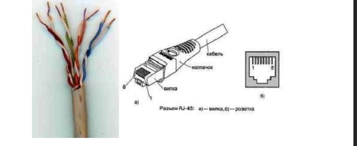
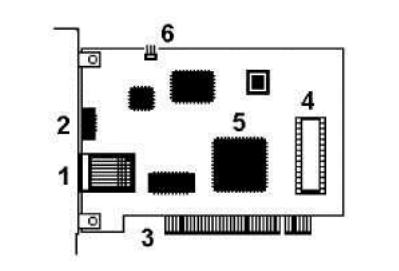

# Лабораторная работа №1
## Подключение персонального компьютера к локальной вычислительной сети

**ФИО студента:** `[Ваше ФИО]`  
**Группа:** `[Номер группы]`  
**Дата выполнения:** `[ДД.ММ.ГГГГ]`  
**Преподаватель:** `[ФИО преподавателя]`

---

## 1. Цель работы
> Приобретение практических знаний и навыков в выборе и установке сетевых адаптеров, монтажу и разделке сетевого кабеля, физическому присоединению ЭВМ к кабельной системе при создании локальной компьютерной сети по технологии Ethernet.

---

## 2. Оборудование и материалы

*Рисунок 1.1 - Кабель UTP категории 5 (слева) и разъем RJ-45, показаны вилка (plug) и розетка (jack)*

| Параметр | Значение |
|----------|----------|
| Тип персонального компьютера | `[Например: IBM PC-совместимый]` |
| Модель сетевой карты | `[Указать модель или "встроенная"]` |
| Тип шины данных сетевой карты | `[PCI / PCIe / встроенная]` |
| Поддерживаемые скорости обмена | `[10/100/1000 Мбит/с]` |
| Тип кабеля | `[UTP категории 5 / 5e / 6]` |
| Количество жил в кабеле | `[4 / 8]` |
| Тип разъема | `RJ-45` |
| Инструмент для обжима | `[Название модели или "универсальный"]` |

---

## 3. Задание к работе

**Тип задания:**  
- [ ] Смонтировать UTP-кабель для соединения ПК с сетевым устройством (концентратором/коммутатором) — *прямой кабель*
- [ ] Смонтировать UTP-кабель для непосредственного соединения двух ПК — *перекрестный (кроссовый) кабель*

**Выбранная схема заделки (T568A или T568B):** `[Указать]`

### Теоретическая справка

Для технологии Ethernet используется топология "звезда" с концентратором в центре, причем определены порты типа MDI (Medium Depended Interface, разъем сетевого адаптера) и MDIX (MDI crossing, разъем портов сетевого концентратора).

*Рисунок 1.2 - Сеть 10BaseT/100BaseTX: a) - звезда, б) - непосредственное соединение двух компьютеров (двухточечное соединение)*

При соединении MDI-MDIX (подключение конечных узлов сети к портам активного оборудования) используется **"прямой" кабель**, при соединении MDI-MDI (непосредственное соединение адаптеров компьютеров) или MDIX-MDIX (соединение двух коммуникационных устройств) используют **"перекрестный" (кроссовый) кабель**.

*Рисунок 1.3 - Интерфейсные кабели Ethernet: a) - "прямой", б) - "перекрестный" (кроссовый)*

---

## 4. Результаты выполнения

### 4.1. Схема расположения жил при обжиме

В 10- и 100-мегабитном Ethernet (10BaseT/100BaseTX) из 8 жил используется только половина; для Gigabit Ethernet (1000BaseTX) используются все 8 медных жил.

*Рисунок 1.4 - Гальваническая развязка*

Порядок жил в разъеме RJ-45 (вид на контакты, защелка снизу):

| Контакт № | Цвет провода (по вашей схеме) |
|-----------|-------------------------------|
| 1 | `[например: Бело-оранжевый]` |
| 2 | `[например: Оранжевый]` |
| 3 | `[например: Бело-зеленый]` |
| 4 | `[например: Синий]` |
| 5 | `[например: Бело-синий]` |
| 6 | `[например: Зеленый]` |
| 7 | `[например: Бело-коричневый]` |
| 8 | `[например: Коричневый]` |

### 4.2. Инструмент и процесс обжима

Кабель UTP соединяется с вилкой RJ-45 без применения пайки. При монтаже вилки RJ-45 на кабель UTP-5 удаляют внешнюю оболочку кабеля на длину 12,5 мм.

*Рисунок 1.5 - Обжимной инструмент для разделки UTP-кабеля (a) и последовательность снятия внешней оболочки с сетевого кабеля (б)*

Варианты заделки проводов показаны ниже:

*Рисунок 1.6 - Варианты заделки проводов*

Последним действием является обжим вилки:

*Рисунок 1.7 - Порядок обжима вилки*

>  *Вставьте скриншот или фото готового обжатого кабеля*

### 4.3. Проверка целостности кабеля

| Контакт | Статус (✓/✗) | Примечание |
|---------|--------------|------------|
| 1 | `[ ]` | |
| 2 | `[ ]` | |
| 3 | `[ ]` | |
| 4 | `[ ]` | |
| 5 | `[ ]` | |
| 6 | `[ ]` | |
| 7 | `[ ]` | |
| 8 | `[ ]` | |

**Метод проверки:** `[Кабельный тестер / Омметр / Визуальный осмотр]`  
**Результат проверки:** `[Кабель исправен / Требует переобжима]`

### 4.4. Параметры сетевой карты

*Рисунок 1.9 - Сетевая карта шины данных PCI: 1- разъем под витую пару (RJ-45), 2- светодиодный индикатор активности сети, 3- шина данных PCI, 4- панелька под микросхему BootROM, 5- микросхема контроллера платы, 6- коннектор подключения для Remote Wake Up*

**MAC-адрес адаптера:** `[XX:XX:XX:XX:XX:XX]`  
**Производитель (по первым 3 байтам):** `[Например: 0080C8 = D-Link]`  
**Адрес ввода-вывода (I/O Port):** `[Например: 0xD000]`  
**Номер прерывания (IRQ):** `[Например: 11]`

> ℹ️ *Для получения данных в Windows используйте:*  
> `ipconfig /all` *или* `getmac /v`

### 4.5. Подключение к сети

| Параметр | Значение |
|----------|----------|
| Тип подключения | `[MDI-MDIX (прямой) / MDI-MDI (кроссовый)]` |
| Подключенное устройство | `[Коммутатор / Другой ПК / Маршрутизатор]` |
| Индикатор активности сети | `[Горит / Мигает / Не горит]` |
| Скорость соединения (определилась автоматически) | `[10/100/1000 Мбит/с]` |

---

## 5. Ответы на контрольные вопросы

**1. Какие сетевые кабели использует технология Ethernet? Что такое кабель UTP? В чем его достоинства и недостатки?**

[Ваш ответ]

**2. Что такое сетевые устройства MDI и MDIX? Для соединения каких устройств необходим "перекрестный" (кроссированный) кабель?**

[Ваш ответ]

**3. Почему при монтаже вилки RJ-45 на кабель нет необходимости снимать изоляцию с отдельных жил кабеля?**

[Ваш ответ]

**4. Что такое "нуль-модемный" кабель и для каких целей он применяется?**

[Ваш ответ]

**5. Каким образом однозначно идентифицируются сетевые адаптеры? С какой целью введена возможность изменения MAC-адреса?**

[Ваш ответ]

**6. В чем заключается процесс конфигурирование сетевой платы? Какие параметры при этом настраиваются?**

[Ваш ответ]
